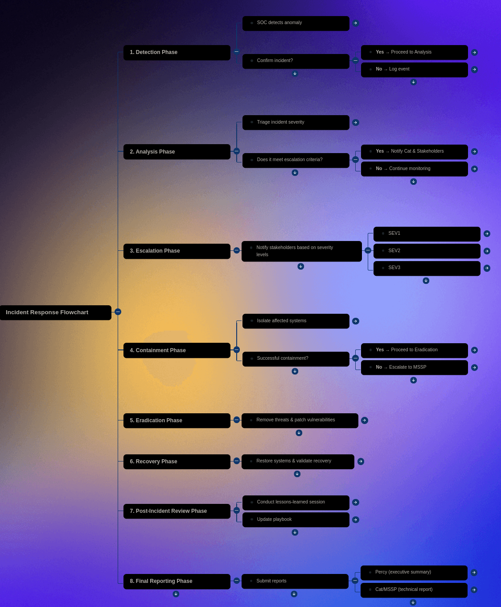

# 🚨 Incident Response Playbooks
### _NIST-Aligned Procedures for Cybersecurity Incidents_

**Quick Links:** [Documentation](README.md) | [Security Policy](SECURITY.md) | [Contributing](CONTRIBUTING.md)

---

## 📊 Quick Reference

*Visual incident response workflow for rapid reference during active incidents*

---

**How to view artifacts:** Main playbook in `Violet Figueroa Playbook for Cat & Box Scenario.pdf/.md`; flow in `Flowchart.png`.

**Result snapshot:** Provides ready-to-use IR steps, roles, and comms for common scenarios.

**Quick review:**

- Docs: `Violet Figueroa Playbook for Cat & Box Scenario.pdf/.md`
- Visual: `Flowchart.png`
- Start with: Roles/comms section, then the scenario checklist

## 🎯 Portfolio Context

**Career Timeline:** Cybersecurity Specialization (2024-2025)  
**Skills Demonstrated:** Incident response planning, digital forensics, communication protocols, stakeholder management, process documentation, crisis decision-making  
**Related Projects:**
- Complements [Vulnerability Assessment](https://github.com/VioletFigueroa/vulnerability-assessment) for full security operations coverage
- Process documentation skills from [Knowledge Pipeline](https://github.com/VioletFigueroa/knowledge-pipeline) and [Resume Automator](https://github.com/VioletFigueroa/resume-automator)

**Why This Matters for Employers:**

Incident response playbooks demonstrate readiness for real security incidents:
- **Structured approach**: Built procedures around NIST incident handling framework
- **Clear communication**: Defined escalation paths and stakeholder notifications
- **Role clarity**: Established responsibilities for coordination and execution
- **Scenario-based**: Created actionable checklists for common incident types
- **Visual documentation**: Flowcharts for rapid reference during high-pressure situations

As a security analyst, this shows I can:
- Respond effectively when security incidents occur
- Follow established frameworks (NIST, SANS)
- Communicate clearly during crisis situations
- Document procedures for team consistency
- Think through incident scenarios systematically

**Key Capabilities:**
- NIST SP 800-61 Incident Handling proficiency
- Digital forensics and evidence preservation
- Incident triage and severity assessment
- Cross-functional stakeholder communication
- Post-incident lessons learned processes

**Real-World Readiness:** Ready to join SOC teams and contribute to incident response immediately.

## Overview

Comprehensive incident response playbooks and procedures for handling various cybersecurity incidents. This project provides step-by-step guidance for incident detection, containment, eradication, and recovery in real-world scenarios.

## Objectives

- Develop clear incident response procedures
- Create action plans for common security incidents
- Establish communication protocols during incidents
- Define roles and responsibilities for incident response
- Enable rapid and coordinated incident handling

## Methodology

- Analysis of common incident types and scenarios
- Development of playbooks based on industry frameworks
- Integration of NIST incident handling procedures
- Testing and validation of response procedures
- Documentation of lessons learned and improvements

## MITRE ATT&CK Framework Integration

These playbooks provide response procedures mapped to **MITRE ATT&CK tactics**, enabling threat-informed incident response:

### Phishing Response Playbook
**Tactics Addressed:** Initial Access, Execution, Persistence
- **T1566.001 - Spearphishing Attachment:** Email analysis, attachment sandboxing, indicator extraction
- **T1566.002 - Spearphishing Link:** URL reputation checking, web proxy logs, browser history forensics
- **T1204 - User Execution:** User interviews, endpoint forensics, process execution timeline
- **Response Actions:** Email quarantine, user credential reset, threat hunting for similar emails

### Ransomware Response Playbook
**Tactics Addressed:** Initial Access → Impact
- **T1486 - Data Encrypted for Impact:** Encrypted file identification, ransomware variant analysis, decryption assessment
- **T1490 - Inhibit System Recovery:** Shadow copy deletion detection, backup integrity verification
- **T1489 - Service Stop:** Service disruption analysis (antivirus, backup services)
- **T1491 - Defacement:** Ransom note collection, attacker communication protocols
- **Response Actions:** Network isolation, forensic imaging, backup restoration, law enforcement notification

### Malware Outbreak Playbook
**Tactics Addressed:** Execution, Persistence, Defense Evasion, Command & Control
- **T1059 - Command and Scripting Interpreter:** PowerShell/CMD logging analysis, script deobfuscation
- **T1055 - Process Injection:** Memory analysis (Volatility), process tree examination
- **T1071 - Application Layer Protocol:** C2 traffic detection, DNS tunneling identification
- **T1027 - Obfuscated Files or Information:** Static and dynamic malware analysis
- **Response Actions:** Endpoint isolation, malware signature creation, threat hunting, IOC distribution

### Insider Threat Response Playbook
**Tactics Addressed:** Collection, Exfiltration
- **T1005 - Data from Local System:** File access logs, USB device usage, data staging locations
- **T1041 - Exfiltration Over C2 Channel:** Proxy logs, SIEM alerts, anomalous data transfers
- **T1048 - Exfiltration Over Alternative Protocol:** DNS exfiltration, ICMP tunneling detection
- **T1567 - Exfiltration Over Web Service:** Cloud storage uploads, personal email usage
- **Response Actions:** User account suspension, legal coordination, digital forensics, HR involvement

### Brute Force Attack Response Playbook
**Tactics Addressed:** Initial Access, Credential Access
- **T1110.001 - Password Guessing:** Failed login analysis, threshold alerting
- **T1110.003 - Password Spraying:** Multi-account attack detection, geographic anomalies
- **T1110.004 - Credential Stuffing:** Credential breach database correlation
- **Response Actions:** IP blocking, account lockout, MFA enforcement, password reset campaign

### Data Breach Response Playbook
**Tactics Addressed:** Collection, Exfiltration
- **T1039 - Data from Network Shared Drive:** File share audit log analysis
- **T1213 - Data from Information Repositories:** SharePoint, database access logs
- **T1020 - Automated Exfiltration:** Large data transfer detection, compression/archiving activity
- **Response Actions:** Legal notification requirements (GDPR, PIPEDA), forensic investigation, regulatory reporting

**Defensive Integration (MITRE D3FEND):**
- **Isolate:** Network segmentation during containment phase
- **Deceive:** Honeypots and decoy credentials for threat detection
- **Evict:** Malware removal, account disablement, system reimaging
- **Restore:** Backup restoration, service recovery, business continuity

**Framework Alignment:**
- **NIST SP 800-61 r2:** Preparation, Detection & Analysis, Containment/Eradication/Recovery, Post-Incident Activity
- **SANS Incident Handler's Handbook:** 6-step process integrated throughout playbooks
- **ISO 27035:** Incident management lifecycle with defined roles and escalation

**Threat Hunting Integration:**
- Each playbook includes threat hunting queries for similar TTPs
- IOC lists (IP addresses, file hashes, domains) for proactive detection
- SIEM correlation rules mapped to specific MITRE techniques

## Key Findings

- Incident categories and classification system
- Step-by-step response procedures for each incident type
- Communication and escalation procedures
- Recovery and post-incident analysis guidance
- Continuous improvement recommendations

## Technologies Used

- Incident management systems
- Security information and event management (SIEM)
- Communication and collaboration tools
- Documentation and flowchart tools
- Forensic analysis tools

## Lessons Learned

- Clear roles/comms reduce delay more than tool tweaks.
- Checklists plus visuals keep responders aligned under pressure.

## Files Included

- [Violet Figueroa Playbook for Cat & Box Scenario.pdf](Violet%20Figueroa%20Playbook%20for%20Cat%20%26%20Box%20Scenario.pdf) - Detailed incident response playbook (PDF format)
- [Violet Figueroa Playbook for Cat & Box Scenario.md](Violet%20Figueroa%20Playbook%20for%20Cat%20%26%20Box%20Scenario.md) - Playbook in Markdown format for easy viewing and editing
- [Flowchart.png](Flowchart.png) - Visual incident response flowchart
- [incident-response-playbooks.md](incident-response-playbooks.md) - Extended project documentation and context
